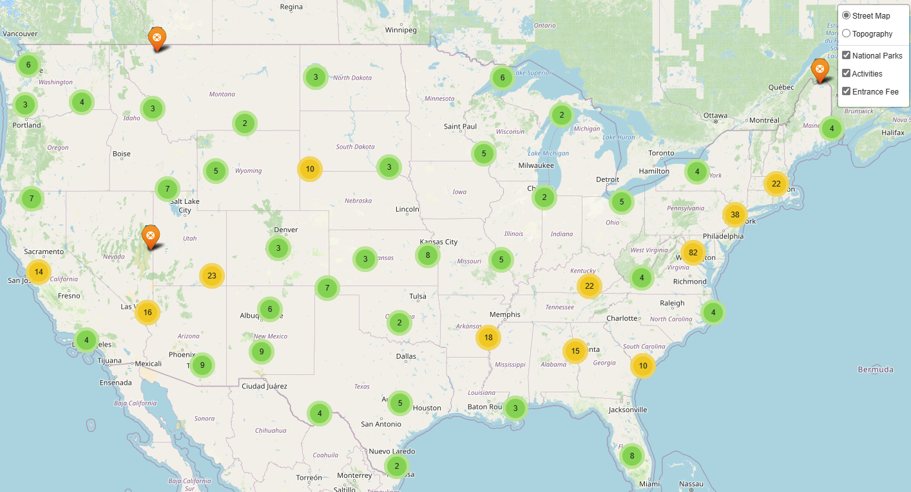
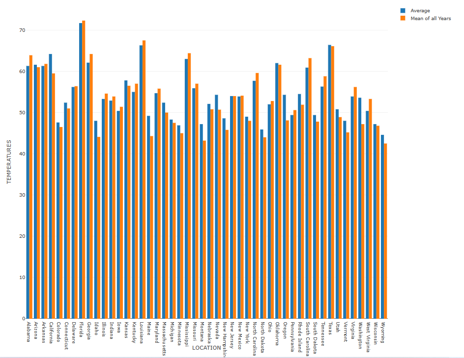

# 
 Plan Your Next Vacation 

## Overview

Let's plan your next vacation to one of the many national parks!

This collaborative project will allow the user to utilize an interactive dashboard that will help them plan their next vacation or road trip. The data includes information on weather, activities, location, associated fees, and much more!

## Analysis 

Data was collected from the National Park Service api as well as a weather api. Jupyter notebook was utilized to initially clean the data before it was transformed into the sqlite database. From the sqlite database, a local api was created using Flask. Data was called from respective tables to create the dashboard with the following interactive utilities:

<h3>
 Activity Map </strong>  
</h3>

The activity map was created using Leaflet and includes the park names, park description, activities that are offered in that particular park, and the entrace fee associated with the park. Marker clustering was used to allow the user to viusalize the data clearly. 

<h3>
 Amenities Map </strong>  
</h3>

    
The amenities map was also created using Leaflet and includes the park names, park description, an image of the park when the popup is clicked on and information about campgrounds near the park.

.png)

 <h3>
 Weather Bar Graph </strong>  
</h3>

The weather page includes information for average temperatures (in Farenheight) for each state from 1901-2021. This page allows the user to choose the month they are looking to travel in and visualize data in a bar graph form for all 50 states. The value of each bar can be easily read by hovering over the desired bar. Plotly was used to achieve the bar graphs.

## Datasets

National Park Service: https://www.nps.gov/subjects/digital/nps-data-api.htm

National Centers for Environmental Information: https://www.ncei.noaa.gov/access/monitoring/climate-at-a-glance/

## Tools Used 

- Jupyter Notebook  
- Flask
- SQLAlchemy
- SQLite
- Plotly
- Leaflet 
- Bootstrap
- Jquery (JavaScript library that makes handling, manipulating, and animating easy to use in many browsers)
- Travel icon pack by Ion Icons

